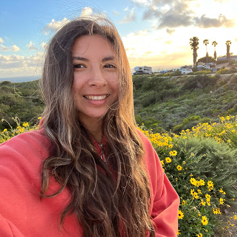

# Welcome to Arlene Garcia's User Page
## 👋 About Me 

` @arlenecse `

📬 [How to Reach Me](#contact-me)

### 🪴Fun Facts
1. I have lived in ***San Diego*** my whole life 🌞
2. My hobbies are *drawing, singing, and reading* 🎨
3. My favorite programming language is `Python` 🐍

### 📜 Motto
> Start early, start often

### ⭐ Personal Goals 
- [x] Attend a networking event
- [x] Build a website
- [ ] Go to a conference
- [ ] Participate in a Hackathon
- [ ] Secure a summer internship

## My Links
**My Personal Project:**
🧯[Wildfire Safety Website](https://arlenecse.github.io/team2-wildfiresafety/)

**Link to README:**
📖 [User Page Readme](README.md)

## Contact Me
- 📧 **Email**: arlene.garcia.school@gmail.com
- 🔗 **LinkedIn**: https://www.linkedin.com/in/arlene-garcia-27260b296/